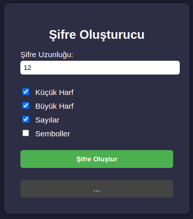

# Şifre Oluşturucu (Password Generator)

Bu proje basit bir şifre oluşturucu uygulamasıdır. Kullanıcı, şifre uzunluğunu ve karakter tiplerini seçerek rastgele bir şifre oluşturabilir.

## 📷 Görsel

## ✨ Özellikler

- Şifre uzunluğu belirleyebilme (min: 4 - max: 32)
- Küçük harf, büyük harf, rakam ve sembol seçenekleri
- Kullanıcı seçimine göre şifre oluşturma
- Geçersiz girişler için uyarı mesajları

## 🛠️ Kullanılan Teknolojiler

- HTML
- CSS
- JavaScript (Vanilla)

## 🚀 Nasıl Kullanılır?

1. Şifre uzunluğunu girin.
2. Hangi karakterleri içereceğini seçin.
3. "Şifre Oluştur" butonuna tıklayın.
4. Şifreniz altta gözükecek.

## 📌 Not

Bu proje öğrenme amaçlı yapılmıştır. Belki daha sonra kopyalama butonu gibi şeyler de eklenebilir.  
Kod sade tutulmaya çalışıldı. Bir iki yerde küçük düzenlemeler gerekebilir.

---

Teşekkürler okuduğunuz için 🙃
